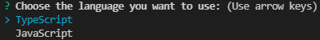

# 说明文档
## `malp`: 一个帮助你快速搭建和开发前端项目的CLI

如何安装？

```shell
npm install malp -g
```

## 创建项目

目前支持React，后期可能会支持Vue3

React项目模块已经帮你配置：

* 常用的目录结构（你可以在此基础上修改）
* craco.config.js（其中配置了别名，你可以自行修改和配置更多）
* 其他等可选配置

创建项目

```shell
malp create your_project_name
```

选择你要使用的语言。



你会被提示选取一个 preset。你可以选默认的包含了基本的 Babel + ESLint 设置的 preset，也可以选“手动选择特性”来选取需要的特性。


这个默认的设置非常适合快速创建一个新项目的原型，而手动设置则提供了更多的选项，它们是面向生产的项目更加需要的。


* Axios（网络请求axios的安装以及二次封装）
* Redux（redux的安装和配置，并配置了thunk中间件以及immutable，另外有动态加载子模块，后面详细说明）
* Router（router的安装和配置，并增加了全局路由守卫和集中管理功能，后面详细说明 ）

自动拉取项目模板


## 项目开发

项目开发目前提供三个功能：

* 创建Redux子模块
* 路由全局守卫
* 路由集中管理

### 创建Redux子模块

默认路径

```shell
malp add store # 例如malp add store，默认会放到当前终端路径文件夹下
```

指定路径(基于当前终端路径下查找)


创建完成后，不需要手动配置，已经动态将所有子模块集成进去：

```typescript
interface ReducersType {
  [key: string]: any
}
const reducers: ReducersType = {}
// @ts-ignore
const files = require.context('@/pages', true, /store\/index\.ts$/)
files.keys().forEach((key: string) => {
  const reducerPath = key.replace('./', '')
  const reducerName = reducerPath.split('/store/')[0]
  reducers[reducerName] = require(`@/pages/${reducerPath}`).reducer
})
```

redux子模块默认会使用创建项目时所使用的语言，如果想更改子模块的文件类型，可以使用`malp change language`来改变当前默认创建语言


### 路由全局守卫

默认关闭守卫功能，如需开启，在` App.tsx`文件中设置 `loginAuth={true}`后将需要鉴权的页面添加上`meta:{auth: true}`

如：

```typescript
{
  path: '/',
  component: Home,
  meta: {
  	//校验此页面
  	auth: true,
  	//可以添加其他参数
	}
},
```

并在`auth.ts`文件中书写校验逻辑

如：

```typescript
import { GuardFunction } from 'react-router-guards';
export const requireLogin: GuardFunction = (to, from, next) => {
  const isLogin: boolean = false
  if (to.meta.auth) {
    if (isLogin) {
      if (to.match.path === '/login') {
        next.redirect('/')
      } else {
        next();
      }
    } else {
      next.redirect('/login');
    }
  } else {
    next();
  }
};
```

### 路由集中管理

在`mainRoutes.ts`文件中添加routes：

```typescript
export interface RouteItem {
  key?: string | number
  path: string
  component?: LazyExoticComponent<MemoExoticComponent<() => JSX.Element>>
  exact?: boolean
  strict?: boolean
  children?: RouteItem[]
  meta?: {
    auth?: boolean
    [key:string]: any
  }
  render?: (...r:any) => JSX.Element
}
```

在使用的地方调用`renderRoutes`将routes传入：

```typescript
export const renderRoutes = (routes: RouteItem[], auth = false, extraProps = {}, switchProps = {}) => routes ?
  createElement(Switch, switchProps, routes.map((route, i): JSX.Element => createElement(auth ? GuardedRoute : Route, {
      ...route,
      key: route.key || i,
      component: undefined,
      children: null,
      render: props => route.render ?
        route.render(Object.assign({}, props, {}, extraProps, { route }))
        :
        createElement(route.component as any, Object.assign({}, props, extraProps, { route }))
    })
  )) : null;
```
